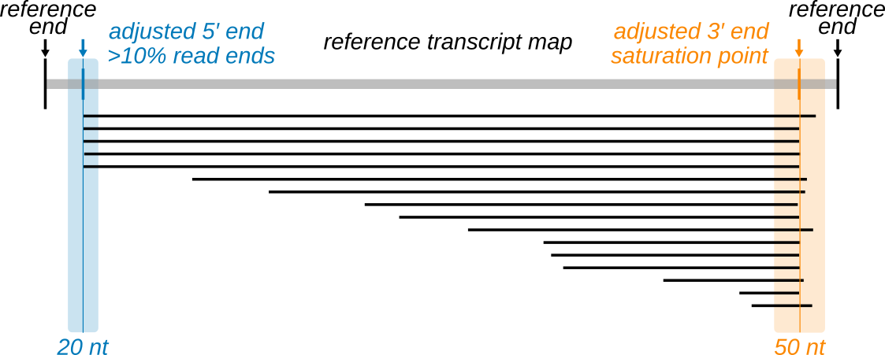
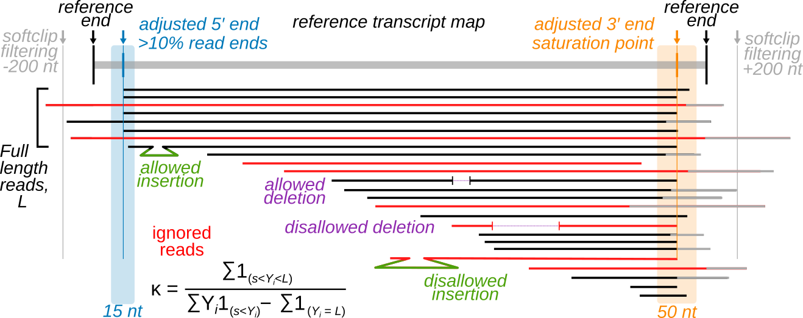
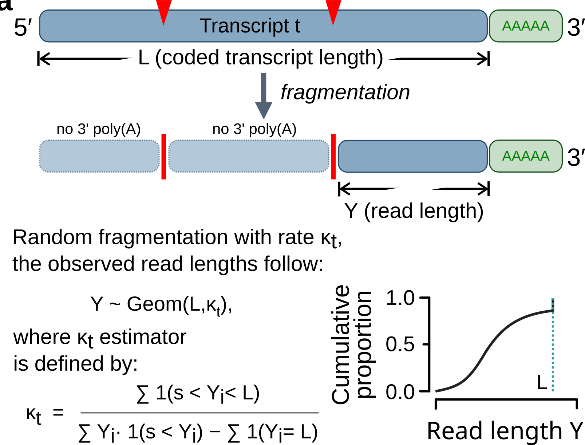
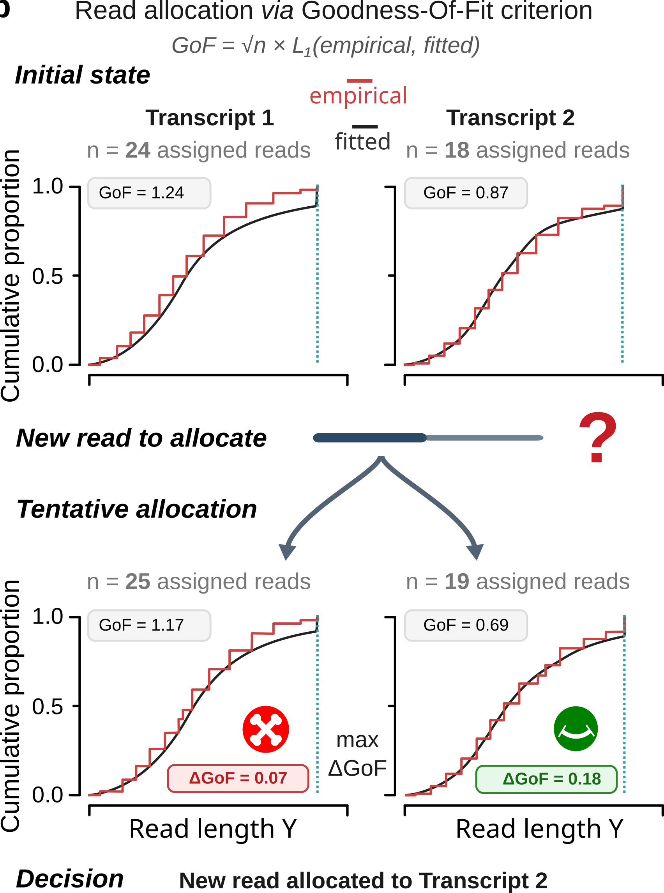

# INDEGRA: Integrity and DEGRadation Analysis of RNA

> **INDEGRA corrects for RNA degradation artifacts in Oxford Nanopore direct RNA sequencing,
> enabling accurate transcript quantification and differential stability testing even from
> partially degraded samples.**

[](https://github.com/Arnaroo/INDEGRA/releases)
[](#licence)
[]()
[](https://doi.org/10.5281/zenodo.20522257)

---

## The problem INDEGRA solves

Direct RNA sequencing (DRS) on Oxford Nanopore platforms reads native RNA molecules from
their 3′ poly(A) tail toward the 5′ end. This architecture means that intact molecules and
degraded (5′-truncated) fragments from the same transcript share the same 3′ origin while only
their 5′ endpoints differ. As a result, a degraded sample contains a mixture of full-length reads
and truncated fragments whose read-length distribution directly reflects the extent of physical
fragmentation.

Standard alignment-and-count pipelines cannot distinguish full-length reads from degradation
fragments. The result is systematic bias in transcript quantification: false differential expression
accumulates as sample quality degrades, reaching up to 6% false positive rates in controlled
experiments. At the gene ontology level, these false hits cluster in specific functional categories,
producing biologically interpretable but entirely artefactual enrichment from a purely technical
perturbation.

A second, related problem affects any RNA-seq experiment on higher eukaryotes: extensively
overlapping transcript isoforms produce reads that map to more than one transcript. Conventional
tools resolve these multi-mapped reads by allocating them proportionally to transcript abundance, a rich-get-richer strategy that systematically inflates counts for shorter or already-abundant
isoforms at the expense of longer counterparts.

INDEGRA addresses both problems simultaneously by modelling per-transcript RNA degradation
and using the fitted profiles, rather than abundance, to guide ambiguous read assignment.

---

## What INDEGRA does *not* require

- No RIN score or degradation ladder is needed. INDEGRA estimates degradation directly
  from the read-end distribution within each sample.
- No spike-in controls (though they can be used for validation).
- No paired "undegraded" reference sample.
- No modification to the sequencing protocol or library preparation.
- No changes to existing downstream workflows: outputs are standard BAM files and TSV
  tables compatible with DESeq2, edgeR, and limma-voom.

---

## How INDEGRA works

INDEGRA operates in four stages on a standard transcriptome-aligned BAM file.

### Stage 1 Reference annotation adjustment

Annotated transcript boundaries often do not match the empirical read-end distributions
observed in a given DRS experiment, due to tissue-specific alternative polyadenylation,
incomplete reference annotations, or alignment artefacts. INDEGRA adjusts each transcript's
3′ end to the position of maximal read-end density (the *saturation point*), and updates the 5′
end to the most frequent read start position if it accounts for at least 10% of observed starts.
By default, this reannotation step uses only **uniquely mapping reads** (i.e. reads that align
unambiguously to a single transcript), ensuring that boundary estimation is not distorted by
reads that could equally belong to another isoform. In well-annotated human transcriptomes,
approximately 50% of expressed transcripts have ends matching the reference; nearly 20% are
shifted by more than 100 nt at the 3′ end.



### Stage 2 Read filtering

Before modelling, INDEGRA censors reads that are uninformative or artefactual:

<!-- Figure: read filtering schematic -->
<!-- [FIGURE 1: Reference transcript map with adjusted 5′ and 3′ ends, full-length reads,
     and the categories of allowed/disallowed insertions, deletions, and soft-clips.] -->

- Reads with maximum insertion >80 nt, maximum deletion >160 nt, or cumulative soft-clip
  >200 nt on either end are discarded (thresholds are user-tunable).
- Reads whose 3′ end falls more than 50 nt from the saturation point are discarded.
- A read is called *full-length* if its 5′ end falls within 15 nt of the adjusted isoform 5′ end.



### Stage 3 Fragmentation modelling

Starting from **uniquely aligned reads only**, INDEGRA estimates the per-transcript
fragmentation rate κ. Random fragmentation of an RNA molecule can be modelled as a
Bernoulli process: κ is the probability that a fragmentation event occurs between any two
consecutive nucleotides. For a transcript of length *L*, this yields a truncated geometric
distribution of read lengths: full-length reads have probability (1 − κ)^(L − 1), and truncated
reads of length *l < L* have probability κ × (1 − κ)^(l − 1). The maximum likelihood estimator
of κ has a simple closed-form expression:

**κ = (number of non-full-length reads) / (total read length − number of full-length reads)**

(retaining only reads longer than a capture-length cutoff *s* = 150 nt, to correct for
short-fragment sequencing bias). Higher κ means more degradation.



### Stage 4 Degradation-aware allocation of multi-mapped reads

With per-transcript κ estimates in hand, INDEGRA allocates reads that mapped to more than
one transcript. For each multi-mapped read, INDEGRA evaluates the change in
goodness-of-fit (Kolmogorov-Smirnov statistic, ΔD) that would result from assigning the read
to each candidate transcript. The read is assigned to the transcript whose fragmentation profile
it best improves (largest ΔD). Fragmentation rates κ are updated iteratively after each
assignment. Optionally, a cross-entropy penalty can supplement the KS criterion.



### Stage 5 Fallback allocation for transcripts with no unique support

Some genes are represented only by multi-mapped reads and no read in the sample maps
unambiguously to a single isoform of that gene. For these, κ cannot be estimated and the
goodness-of-fit criterion is undefined. INDEGRA assigns all such reads to the **shortest
transcript that spans the full genomic extent of the multi-mapped read set** for that gene
family, a conservative choice that avoids introducing spurious isoform counts.

### Two-round refinement

INDEGRA runs the full pipeline in **two rounds**. At the end of Round 1, every read has
been assigned to exactly one transcript. Round 2 repeats Stages 1-3 using this complete
assignment: transcript boundaries are reannotated using all now-uniquely-assigned reads,
and κ is re-estimated on the polished read set. This second pass refines the degradation
estimates and corrects any boundary biases introduced in the first round by incomplete read
coverage.

In a typical high-quality human sample, INDEGRA uniquely attributes 75% of reads in
Round 1, re-allocates ~10% based on degradation fit, assigns 5% via the fallback rule, and
removes ~10% by quality filtering. More degraded samples receive larger corrections.

---

## The Direct Transcript Integrity (DTI) metric

The per-transcript fragmentation rate κ is mapped to the **Direct Transcript Integrity (tDTI)**:
a score designed to behave analogously to the sample-level RIN. A tDTI of **10** indicates no
detectable fragmentation; a tDTI of **1** indicates maximal degradation. The per-sample DTI is
the median of all transcript-level tDTI values.

DTI offers three advantages over RIN.
**1. Isoform resolution:** individual transcripts within the same sample can differ dramatically
   in integrity, information invisible to any sample-level metric.
**2. Composition-agnostic:** computable for any DRS dataset, including synthetic
   transcriptomes and poly(A)-enriched preparations that lack ribosomal RNA.
**3. Isoform-specific stability:** captures genuine transcript-level stability differences, not
   just sample-wide quality.

DTI was validated against RIN across 56 total RNA samples from human, mouse, rat, chicken,
cow, and dog tissues, confirming excellent correlation with the established metric.

---

## Bayesian differential stability testing

While DTI captures total degradation per transcript, biological and technical degradation have
different characteristics: biological turnover is transcript-specific and condition-dependent,
whereas technical degradation from sample handling affects all transcripts in a sample globally.
INDEGRA's Bayesian framework decomposes the observed fragmentation rate κ into a biological
component (τ) and a technical component (α):

**κ = 1 − (1 − τ) × (1 − α)**

A per-transcript posterior probability test (δDTI) identifies transcripts with significantly different
biological degradation between conditions, even when samples differ substantially in overall
quality. In controlled experiments, this test maintains a false positive rate of 1-2% regardless
of induced technical degradation, compared to up to 27% false positives with a naive global
test. Sensitivity across 1×1 and 2×2 replicate designs was validated by spike-in experiments
(ROC AUC 0.79-0.98; false positive rate 0.3-0.6% at posterior threshold 0.5).

---

## Quick start

### Requirements

INDEGRA is implemented in the **D programming language** (LDC2 compiler) and distributed as
self-contained, pre-compiled binaries. No runtime environment, interpreter, or shared library is
required; the Linux and Windows binaries are fully statically linked, and the macOS binary
ships as a relocatable `.app` bundle. INDEGRA runs from the command line on all three
platforms.

Input: a transcriptome-aligned BAM or SAM file produced by tools such as minimap2.
INDEGRA is agnostic to the choice of basecaller and accepts reads basecalled with either
**Guppy** or **Dorado** (Oxford Nanopore's current production basecaller).
Recommended alignment: `minimap2 -ax map-ont -N 10 transcriptome.fa reads.fastq`

### Installation

Download the appropriate pre-compiled release from the
[Releases page](https://github.com/Arnaroo/INDEGRA/releases):

| Platform | Asset | Notes |
|----------|-------|-------|
| Linux x86-64 (HPC: Intel Broadwell / Skylake / Cascade Lake +) | `INDEGRA-X.Y.Z-linux-x86_64-hpc.tar.gz` | Statically linked, AVX2+FMA |
| Linux x86-64 (modern AMD: Ryzen 3000+ / EPYC Rome+) | `INDEGRA-X.Y.Z-linux-x86_64-zen2.tar.gz` | Statically linked, znver2 tuned |
| macOS arm64 (Apple Silicon, macOS 13+) | `INDEGRA-X.Y.Z-macos-arm64.dmg` | `.app` bundle + CLI |
| Windows x86-64 (Windows 10/11) | `INDEGRA-X.Y.Z-windows-x86_64.zip` | Portable .exe, no install needed |

**Linux:**

```bash
tar xzf INDEGRA-X.Y.Z-linux-x86_64-hpc.tar.gz
cd INDEGRA/
./INDEGRA --help
```

**macOS:**

Open the `.dmg`, drag `INDEGRA.app` into `/Applications`. The CLI binary is exposed at
`/Applications/INDEGRA.app/Contents/MacOS/INDEGRA`; for convenience, symlink it onto
your PATH:

```bash
sudo ln -s /Applications/INDEGRA.app/Contents/MacOS/INDEGRA /usr/local/bin/INDEGRA
INDEGRA --help
```

On first launch Gatekeeper may warn that the developer cannot be verified; right-click the
app and choose **Open**, or run `xattr -dr com.apple.quarantine /Applications/INDEGRA.app`.

**Windows:**

Extract the portable ZIP anywhere and run `INDEGRA.exe` from a Command Prompt or
PowerShell:

```cmd
INDEGRA.exe --help
```

### Running INDEGRA

**Single sample:**

```bash
INDEGRA -b sample.bam -s MySample -o results/
```

**Two conditions with 2 replicates each:**

```bash
INDEGRA -b ctrl_r1.bam,ctrl_r2.bam,treat_r1.bam,treat_r2.bam \
        -s Ctrl_R1,Ctrl_R2,Treat_R1,Treat_R2 \
        --conditions Control,Treatment \
        --replicates 2,2 \
        -o results/ \
        --writeFinalBam
```

**Three conditions with varying replicate counts:**

```bash
INDEGRA -b c1r1.bam,c1r2.bam,c1r3.bam,c2r1.bam,c2r2.bam,c3r1.bam \
        -s C1R1,C1R2,C1R3,C2R1,C2R2,C3R1 \
        --conditions Control,TreatA,TreatB \
        --replicates 3,2,1 \
        -o results/
```

**Re-run comparison only (skipping reprocessing of BAM files):**

```bash
INDEGRA -o results/ \
        -s Ctrl_R1,Ctrl_R2,Treat_R1,Treat_R2 \
        --onlyComparison \
        --conditions Control,Treatment \
        --replicates 2,2
```

**Fast mode, unique reads only (skips reallocation, lower memory):**

```bash
INDEGRA -b sample.bam -s MySample -o results/ --uniqueOnly
```

**Low-memory mode for large datasets or HPC nodes with limited RAM:**

```bash
INDEGRA -b large.bam -s BigSample -o results/ \
        --forceSequential --sequentialBam --disableInnerParallelism
```

Full documentation of all options is available via:

```bash
INDEGRA --help
```

---

## Output files

| File | Description |
|------|-------------|
| `*_final_reallocated.bam` | Final BAM with all reads uniquely assigned to a transcript; includes a per-read degradation tag |
| `*_allocated_reads.txt` | Full read allocation table: one row per read, with assigned transcript, allocation method, and read class |
| `*_uniquely_mapped_reads.txt` | Read allocation table restricted to reads that mapped uniquely in the original alignment |
| `*_process.txt` | Per-transcript summary: κ estimate, DTI, number of reads allocated, goodness-of-fit statistics, and other key metrics, computed from all allocated reads |
| `*_UniqueMappedOnly.txt` | Same per-transcript summary as above, computed from uniquely mapping reads only |
| `diff_stability.tsv` | Differential biological degradation results (δDTI posterior probabilities), produced when running with `--conditions` |

The final BAM file is directly compatible with downstream tools including DESeq2, edgeR,
and limma-voom for differential expression analysis.

---

## Validation

INDEGRA was validated on:

- **HEK293 degradation series** with total RNA fragmented for 50, 100, 200, and 400 seconds
  with magnesium; INDEGRA maintained false positive rates below 1% at all degradation
  levels, compared to up to 6% for SubRead, Samtools, NanoCount, and Bambu.
- **Correlation with 4-thiouridine half-life measurements** where INDEGRA-derived κ_deg correlated
  significantly with published HEK293 4sU metabolic labelling datasets from Narula et al. 2019,
  Lugowski/DRUID 2018, and Luo et al. 2020 (Pearson r = 0.45-0.64 on Ensembl
  single-isoform protein-coding genes; all p < 0.001).
- **Multi-species tissue atlas** where it was applied to 56 DRS samples spanning human, mouse, rat,
  chicken, cow, and dog tissues (cerebellum, frontal cortex, hippocampus, liver, skeletal muscle,
  testis); degradation rates cluster by tissue type and reflect known tissue-specific stability
  programs conserved across mammals.
- **B-cell ALL cell lines** where INDEGRA was applied to GM12878, REH (ETV6-RUNX1+), and KOPN8
  (KMT2A-MLLT1+); degradation correction recovers a coherent BCR remodelling signature in
  KOPN8 that is obscured by naive counting.
- *C. elegans* **aging** where INDEGRA's differential stability analysis across Day 1, Day 7, and Day 15 adult
  worms reveals developmental transitions in RNA turnover from growth to reproduction.

---

## Citing INDEGRA

If you use INDEGRA in your research, please cite the archived software release:

This version (v1.2.0): https://doi.org/10.5281/zenodo.20522258

All versions (concept DOI, always resolves to the latest): https://doi.org/10.5281/zenodo.20522257

---

## Repository layout

This repository contains the **pre-compiled INDEGRA binaries** and accompanying
documentation. The INDEGRA source code is held in a separate proprietary repository and is
**not** distributed here.

```
INDEGRA/
├── bin/
│   ├── linux/          Pre-compiled Linux x86-64 binaries (HPC/Broadwell and Zen2 variants, .tar.gz)
│   ├── macos/          Pre-compiled macOS arm64 (.dmg installer and .tar.gz)
│   ├── windows/        Pre-compiled Windows x86-64 (portable .zip)
│   └── SHA256SUMS.txt  Checksums for all binary archives
├── Figures/            Schematic figures referenced from this README
├── Archives/           Snapshot of the obsolete pre-v1.2.0 repository, kept for provenance only
├── LICENSE.txt         CC-BY-NC-ND-4.0 (covers all distributed binaries)
└── README.md           This file
```

All Linux binaries are statically linked (verified with `file <binary>` reporting
"statically linked"). The Windows `.exe` links the MSVC C runtime statically and depends
only on Windows system DLLs (`KERNEL32`, `ADVAPI32`, `WS2_32`). The macOS `.app` is
relocatable and self-contained.

---

## Licence

INDEGRA is developed by the **Biocodecs group** and **Arnaroo Ribologicals** together with the **COMPASS** and **RMODEL** divisions of Biocodecs.org
(Copyright 2024-2026, https://biocodecs.org / https://github.com/Arnaroo).

The pre-compiled binaries distributed in this repository are released under the
**Creative Commons Attribution-NonCommercial-NoDerivatives 4.0 International (CC-BY-NC-ND-4.0)**
licence. You may use them freely for non-commercial academic research with attribution.
For commercial use or source-code licensing, contact:
[alice.cleynen@biocodecs.org](mailto:alice.cleynen@biocodecs.org) or
[nikolay.shirokikh@biocodecs.org](mailto:nikolay.shirokikh@biocodecs.org) or
[contact@biocodecs.org](mailto:contact@biocodecs.org).

The INDEGRA D source code remains proprietary and is **not** included in or distributed
with this repository.

---

## Contact

Alice Cleynen (CNRS / Université de Montpellier), [alice.cleynen@cnrs.fr](mailto:alice.cleynen@cnrs.fr)

Nikolay Shirokikh (University of Western Australia), [nikolay.shirokikh@uwa.edu.au](mailto:nikolay.shirokikh@uwa.edu.au)

Issues and questions: [GitHub Issues](https://github.com/Arnaroo/INDEGRA/issues)
